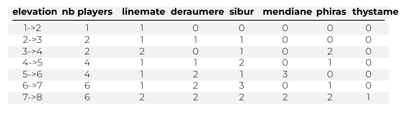

# Zappy
An Epitech Project made by:

<div style="display: flex; justify-content: center;">
  <div style="margin-right: 20px;">
    <a href="https://github.com/NattanCochet" style="text-decoration: none; display: block; text-align: center;">
      
      <sub style="display: block;">COCHET Nattan</sub>
    </a>
  </div>
  <div style="margin-right: 20px;">
    <a href="https://github.com/Priax" style="text-decoration: none; display: block; text-align: center;">
      
      <sub style="display: block;">MONTERO FONTAINE Vincent</sub>
    </a>
  </div>
  <div style="margin-right: 20px;">
    <a href="https://github.com/Sonny-Rameaux" style="text-decoration: none; display: block; text-align: center;">
      
      <sub style="display: block;">RAMEAUX Sonny</sub>
    </a>
  </div>
  <div>
    <a href="https://github.com/Ghost8-0-8" style="text-decoration: none; display: block; text-align: center;">
      
      <sub style="display: block;">HUANG Elisa</sub>
    </a>
  </div>
  <div>
    <a href="https://github.com/Anagon1803" style="text-decoration: none; display: block; text-align: center;">
      
      <sub style="display: block;">URBON Anaëlle</sub>
    </a>
  </div>
  <div>
    <a href="https://github.com/quidamzx" style="text-decoration: none; display: block; text-align: center;">
      
      <sub style="display: block;">BENZIDANE Adam</sub>
    </a>
  </div>
</div>


## Description
The goal of this project is to create a network game where several teams confront each other on
a tile map containing resources.
The winning team is the first one where at least 6 players reach the maximum elevation.

There is a server, handling all the commands.

A GUI, showing the data in a more human-friendly way.

And the "AI" which goal is to win the game.

## Features

### Ressources :

The environment is rather rich in resources (mineral as well as dietary).
Therefore, by walking around this planet, the players can find succulent food and a variety of
natural stones.
These stones have six distinct categories, as follows:

- linemate
- deraumere
- sibur
- mendiane
- phiras
- thystame

### Elevation

Everyone’s goal is to rise up in the Trantorian hierarchy.
This ritual, which enhances physical and mental capacities must be done according to a partic-
ular rite: they must gather the following on the same unit of terrain:
✓ At least a certain number of each stones
✓ At least a certain number of players with the same level
The elevation begins as soon as a player initiates the incantation.
It is not necessary for the players to be on the same team; they only need to be of the same level.
Every player in a group doing an incantation attain the higher level.


## Compilation via Makefile

```bash
    make
```
To clean:
```bash
    make clean
```

## Usage

```bash
    ./zappy_server -p port_number -x map_width -y map_height -n team_name1 team_name2 ... -c clients_per_team -f command_frequency
```

## More documentation with Doxygen

```bash
    doxygen config
    open html/index.html
```
